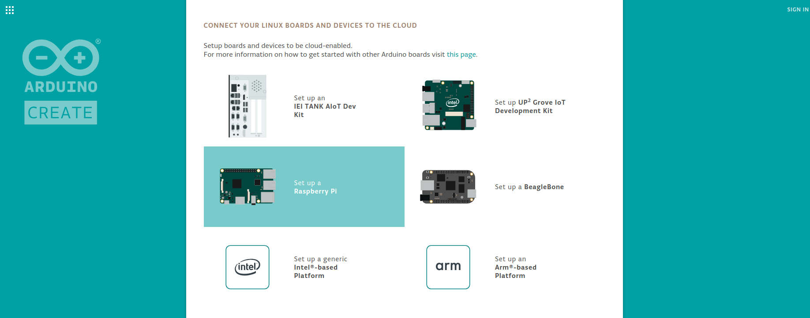
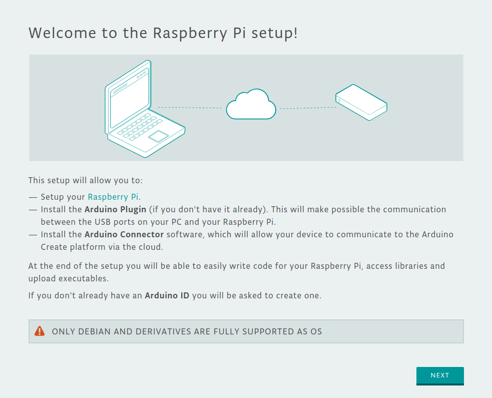
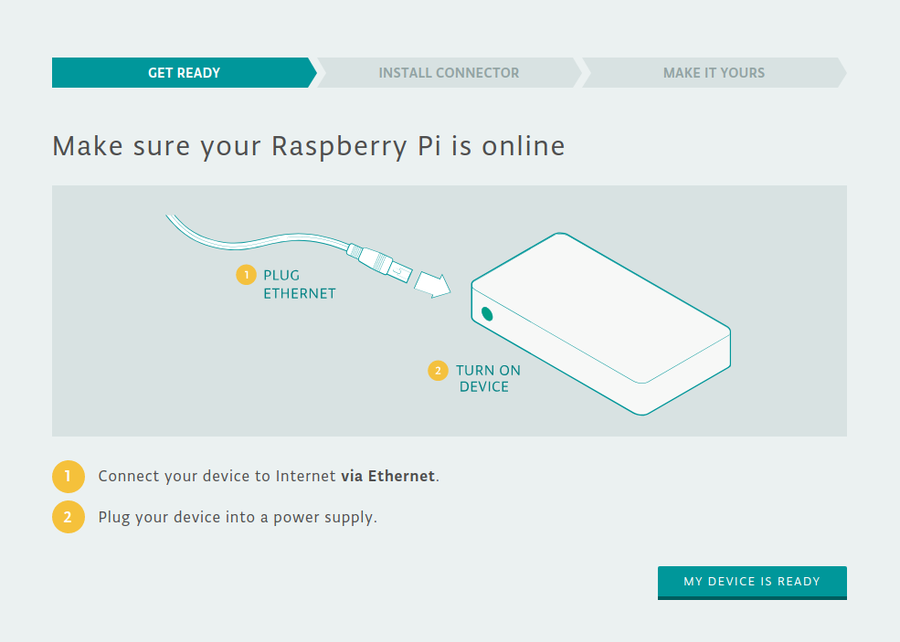
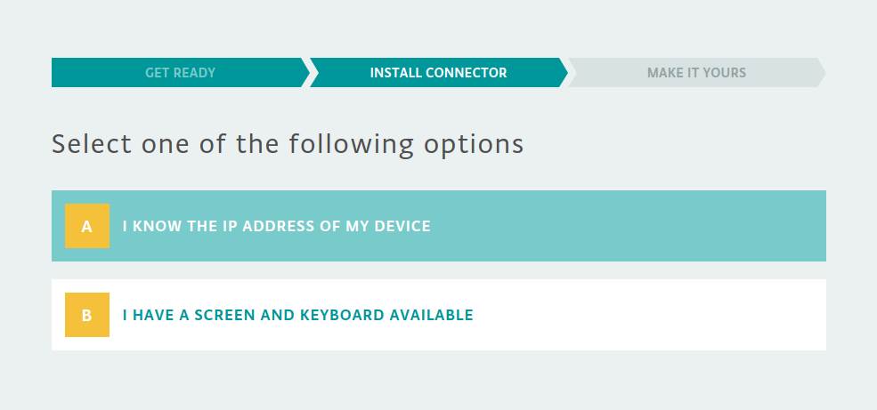
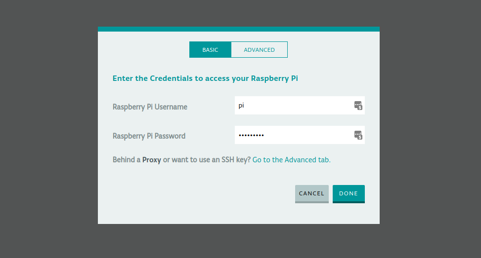
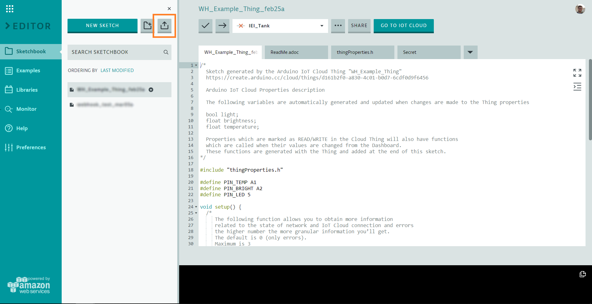
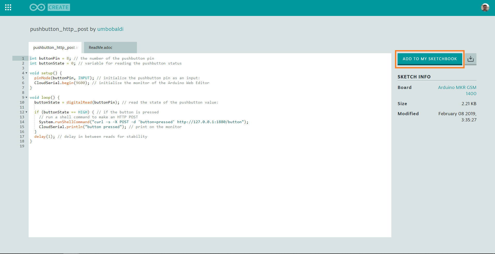

In this tutorial we'll show you how you can use a **Raspberry Pi** in conjunction with the **Arduino Create** platform to create some cool projects involving face detection, Node-RED flows and Mqtt messages!
The tutorial will be divided into seven iterations. In each iteration we will add a new ingredient to the project in order to achieve our final goals at Iterations 6 and 7.

# 1st Iteration: Raspberry Pi setup

In the first iteration we'll setup our Raspberry Pi and test that the GPIOs are working. We'll be using [Raspbian Stretch Lite](https://www.raspberrypi.org/downloads/raspbian/), which is the newest version of Raspbian at the current time, installed on a *Raspberry Pi 3b+*. We'll use the Lite version because we don't need the GUI. It's easier to work on it if you have SSH enabled. To achieve that goal you have to create an empty file named **ssh** (with no extension) and put it in the boot partition of the microSD card.

After powering up the Raspberry, we need to get its **IP address** in order to **ssh** into it. We have two option for this:
- We can connect the Raspberry Pi to our pc using an **Ethernet cable** (here are some guides for [Windows 10](http://www.circuitbasics.com/how-to-connect-to-a-raspberry-pi-directly-with-an-ethernet-cable/) and [Ubuntu 16.04](https://raspberrypi.stackexchange.com/questions/30144/connect-raspberry-pi-to-pc-ubuntu-with-ethernet/61004#61004));
- Or we can connect via **WiFi** (but we will need keyboard and display). Once logged in, just run `sudo ifconfig` and read the IP address next to the `wlan0` entry. 
Now that we now the Raspberry IP, we can control it (in a bash window) using SSH with the command:
``` bash
$ ssh pi@<ip_address_raspi>
```

The default log-in informations are: user: `pi`, password `raspberry`.

### GPIO Libraries

At this point we need to check if the **GPIO libraries for Python** are already installed/updated.
``` bash
$ sudo apt-get update
$ sudo apt-get install python-rpi.gpio python3-rpi.gpio
```

Then, we can write two simple Python scripts to check the status of a pushbutton (connected to Pin 8 - i.e. GPIO 14, see the Raspberry pinout below) and to write a message on the terminal (`pushbutton.py` and `pushbutton_event.py` in the repo linked at the end of the tutorial). The second script uses the events related to GPIO pins to call a function which prints the button status on the terminal. This is a more complex way, but the most efficient one.

Let's create a new folder to **save the scripts**:
```bash
$ cd ~
mkdir python-data
```

Now transfer the two script files to the Raspberry Pi:
- On Linux, we can use the `scp` command from our local machine (if you copy bash command from here, remember to first clone the github repository in `~/Documents/`): 
``` bash
$ scp ~/Documents/first_iteration/pushbutton.py ~/Documents/first_iteration/pushbutton_event.py pi@<ip_address_raspi>:~/python-data/
```
- On Windows, we can use an ssh client like [PuTTY](https://www.putty.org/) or [WinScp](https://winscp.net/eng/index.php). For a more complete guide on file transfer have a look at [this tutorial](https://it.cornell.edu/managed-servers/transfer-files-using-putty).

If `scp` is not working (e.g. we get Permission Denied), we need to change ownership of the destination folder in the Raspberry using the command `chown pi python-data`.

For all the connections to the Pi, we used the following scheme:

If you want further information on the GPIO pins you can read something useful [here](https://www.raspberrypi.org/documentation/usage/gpio/, "GPIO documentation")

To **run the scripts** simply run this command:
```bash
$ python3 ~/Documents/first_iteration/pushbutton.py
```
or
```bash
$ python3 ~/Documents/first_iteration/pushbutton_event.py
```

---
# 2nd Iteration: adding Docker

After installing Raspbian and testing the GPIO pins, let's add **Docker**!

First of all, we need to bind the Raspberry Pi to our Arduino account by following the [Getting Started flow](https://create.arduino.cc/getting-started). Create a new account, if you don't have one yet.



Select Raspberry Pi in the device lists, then follow the instructions...




Select option A and enter the IP addres of the Raspberry (which we know from the 1st Iteration).



Now we will be prompted with a modal asking for the Raspberry Pi credentials (if you did not changed them, default are `pi` and `raspberry`).



Doing this will install some software on the Raspberry Pi, including the [Arduino Connector](https://github.com/arduino/arduino-connector) and Docker. 

If we don't want to use `sudo` each time we use docker, we need to create a group named `docker` and add our user to it:
```bash
$ sudo groupadd docker
$ sudo usermod -aG docker $USER
```

For our project we need [Node-RED](https://nodered.org/), which is a **flow-based development tool** for wiring together hardware devices, APIs and online services as part of the Internet of Things.

We can use this [Node-RED Docker container](https://hub.docker.com/r/nieleyde/rpi-nodered-gpio/) which is already configured for GPIO use. To install and run the container we can execute the following command:

```bash
$ docker run -d -p 1880:1880 -v ~/node-red-data:/data --privileged --name mynodered nieleyde/rpi-nodered-gpio:latest
```

Here's a brief explanation of it:
- `run -d nieleyde/rpi-nodered-gpio:latest` This command will download the container from DockerHub (if it's not already been downloaded) and run it in background;
- `-p 1880:1880` This option exposes 1880 port outside the container;
- `-v ~/node-red-data:/data` This option mounts the host’s *~/node-red-data* directory as the user configuration directory inside the container. It's useful to backup *flows.json* file. This file contains the configuration of all flows created in Node-RED browser editor;
- `--privileged` This option allows the container to access to all devices, in particular to Raspberry's GPIO pins;
- `-- name mynodered` This option gives a human readable name to the container;

Now we can check the status of the container with `docker ps`: it should be *up*. Furthermore we can stop the container with `docker stop mynodered` and start it again with `docker start mynodered`.

It's also possible to **modify the flow and nodes** through Node-RED's browser web interface, connecting to this URL: `http://<ip_address_raspi>:1880/`.

Finally it's also possible to **restore** the backup of Node-RED's **nodes and flows** using scp to copy `flows.json` in the folder node-red-data created before.
```bash
$ scp ~/Documents/second_iteration/flows.json pi@<ip_address_raspi>:~/node-red-data/

```
The example `flows.json` in this iteration simply reads the value of a GPIO input pin (Pin 8) and prints its values in the debug tab.

### Second Iteration alternative

For the 2nd Iteration we could have used the [official container of Node-RED](https://hub.docker.com/r/nodered/node-red-docker/). To make it work, we need to use this command:
```bash
docker run -d -p 1880:1880 -v ~/node-red-data:/data --user=root --privileged --name nodered nodered/node-red-docker:0.18.7-rpi-v8

```
It is better to use this container because it is the official one, so it's better mantained and more updated in comparison to the one we used previously. We need to run this container with `--user=root` beacuse in its [Dockerfile](https://github.com/node-red/node-red-docker/blob/master/rpi/Dockerfile) the developers created the user `node-red` which cannot access `/dev/mem` (to control the GPIO pins). Further information about users [here](https://docs.docker.com/engine/reference/run/#user,).

---
# 3rd Iteration: using Arduino Web Editor

Our goal in this iteration is to write an **Arduino sketch** which reads the value of a pushbutton and notifies Node-RED inside the Docker container. The flow in Node-RED has to rework the value received from the sketch and **send an email** to a speicifed email address. 

For this step there's no need of configuring anything. We simply have to import and flash the arduino sketch on the Raspberry Pi using the [Arduino Web Editor](https://create.arduino.cc/editor/) and import the flow in Node-RED. 

We can upload the sketch in two different ways:
- By downloading the sketch `pushbutton_http_post.ino` and importing it into the editor;



- By opening [this sketch](https://create.arduino.cc/editor/Arduino_Genuino/4ade6370-e98e-4dbf-bf3a-88767deb00cd/preview) directly in the web editor.



The sketch reads the status of the pushbutton (connected to Pin 8) and, if it's pressed, performs an **HTTP POST request** using the bash command curl. The request is directed to Node-RED's ip and port.

On the Node-RED side we have to **import the flow** located in the third_iteration folder (in the github repo):
- We can do that as described in the 2nd Iteration, but copying this new flow:
```bash
$ scp ~/Documents/third_iteration/flows.json pi@<ip_address_raspi>:~/node-red-data/

```
- Or you can use a simpler solution: open the `flows.json` file and copy all its content to the clipboard, then use Node-RED import function (*toast menu > import > clipboard*).

The flow for this iteration should look like this:

<kbd>
  
</kbd>

To make it work we need to add the properties inside the e-mail node (recipient, e-mail address and password).

<kbd>
  
</kbd>

If using a gmail account it may be necessary to disable **less secure** apps [here](https://myaccount.google.com/lesssecureapps).

Now it's time to deploy the flow and test it!

---
# 4th Iteration: the OpenCV library

In this iteration we are going to test [OpenCV](https://opencv.org/), which is a **computer vision library** written in C/C++ supporting Python. Our goal for now is to install OpenCV, take a photo and save it using this library. Since it's not an easy task to install it, we can use a docker container already built! We can use this one which comes already compiled for Raspberry Pi and Raspbian Stretch.

To install it use this command:
```bash
$ docker run -it --privileged -v ~/opencv-data:/data --name opencv sgtwilko/rpi-raspbian-opencv:stretch-latest
```
The options used in this command were already described in the 2nd Iteration. By the way, the option `--priviliged` let the container access all the peripherals connected to our Raspberry, even the webcam (or Raspberry Pi Cam).

As usual we can stop the container with `docker stop opencv` and start it again with `docker start -i opencv` (option `-i` attaches container's STDIN).

Now we should be in the container's bash! First of all let's check if **OpenCV is installed** by running **Python interpeter**:
``` bash
$ python
Python 2.7.13 (default, Nov 24 2017, 17:33:09) 
[GCC 6.3.0 20170516] on linux2
Type "help", "copyright", "credits" or "license" for more information.
>>>
```
And then try to import OpenCV library:
```
>>> import cv2
>>> 
```
If there isn't any error, we can move on to the next part. To exit the interpreter use `exit()`.
```
>>> exit()
```

The python script in the github repo (`test.py`) simply takes a photo using the webcam and saves it in `/opencv-data/opencv.png`.

As previously described, we can copy the script into the Raspberry using `scp`:
```bash
scp ~/Documents/fourth_iteration/test.py pi@<ip_address_raspi>:~/opencv-data/
```
To run the script, let's start the docker container (`docker start -i opencv`), move to the correct directory (`cd opencv-data/`) and finally run the script with `python test.py`.

We can open and see the photo if we copy it back to our pc:
```bash
scp pi@<ip_address_raspi>:~/opencv-data/opencv.png ~/Documents/
```
___

# 5th Iteration: doing some face detection

In this iteration we are going to do some **face detection**! This step clearly requires to have OpenCV installed on the Raspberry Pi, as shown in the 4th Iteration.

Basically, face detection will detect if a photo contains a face and will find the position of the face, highlighting it with a green rectangle (see figure below).

Before OpenCV                     | After OpenCV
:--------------------------------:|:----------------------------------:
 | 

OpenCV uses a **cascade file** (an **.xml** file) which contains data to detect objects, in our case faces. We only have to initialize it in our code. OpenCV comes with different built-in cascades for detecting several things such as eyes, hands, legs, animals and so on... In this tutorial we are going to use **Haar Cascade Classifier**. It is a machine learning based approach where a cascade function is trained from a lot of positive (images with faces) and negative (images without faces) images.

So, we need to copy the cascade file (`haarcascade_frontalface_alt.xml`) to the Raspberry:
```bash
scp ~/Documents/fifth_iteration/haarcascade_frontalface_alt.xml pi@<ip_address_raspi>:~/opencv-data/
```
The we can copy some test images to the Raspberry:
```bash
scp ~/Documents/fifth_iteration/test.jpg pi@<ip_address_raspi>:~/opencv-data/
```
The python script in the github repo (`face_detection.py`) opens a photo passed as argument, tries to find faces and saves the image with detected faces in the same folder. We can copy the script to the Raspberry with:
```bash
scp ~/Documents/fifth_iteration/face_detection.py pi@<ip_address_raspi>:~/opencv-data/
```

Now that everything is configured, let's start the script! Similarly to the previous iteration, we have to start the docker container first (`docker start -i opencv`), then we move to the correct directory (`cd opencv-data/`) and finally we run the script (`python face_detection.py test.jpg`).

We can open and see the modified photo by copying it to our pc:
```bash
scp pi@<ip_address_raspi>:~/opencv-data/test_ocv.jpg ~/Documents/
```

---

# 6th Iteration: putting it all together

In this iteration we are going to put together all the previous iterations.


This is the idea:
- An **Arduino sketch** will run every 15 seconds a shell command to start a docker container;
- The **docker container** which contains **OpenCV** will run a **python script** on startup. This script will take a photo using a webcam, will detect faces in that photo and will save the image (with detected faces) in a **docker shared volume** with the name `opencv.png` if at least one face is found. After all that, the container will stop;
- In another docker container, a flow in **Node-RED** will watch the shared volume, waiting for changes in the file `opencv.jpg`. If the file has changed (i.e. the photo has been overwritten), the flow composes an e-mail (attaching the photo) and sends it to a specified e-mail address.

<kbd>
  
</kbd>

### Arduino sketch

Let's start with the Arduino code. The upload procedure to the Raspberry has already been explained in the 3rd Iteration. The code can be found at the end of the tutorial, or directly [here](https://create.arduino.cc/editor/Arduino_Genuino/ee18d8d1-f67c-4c12-ba5b-5239d5421338/preview).

### Docker container for OpenCV

The OpenCV docker container part is a bit more complex. First of all we have to create a docker volume to **share data between the two containers**:
``` bash
docker volume create share
```
To check if everything is ok we can check the list of volumes: we should see the volume we just created with `docker volume ls`.

We can create a docker image to simplify the procedure, but we could also build the image by ourselves as explained in the section **Docker build OpenCV** below. With Docker already installed on the Raspberry, just download [this image](https://hub.docker.com/r/umbobaldi/opencv_face_detection/) by running the command:

``` bash
    docker run -it --privileged -v share:/data --name face_detection umbobaldi/opencv_face_detection:1.0
```
Some notes:
- `-it` let us see a short log and check if everything is ok;
- `-v share:/data` mounts the docker volume share and binds it with */opencv-data* folder inside the container.

The downloaded image is already configured to run on startup a python script which uses OpenCV. This script does the following:
- It takes a photo using the webcam;
- It does some face detection, as described in the 5th Iteration;
- It saves the photo (`opencv.png`) in the opencv-data folder, which is connected to the shared volume, if at least one face is found. Otherwise nothing is saved.
- When the script finish the execution, the docker container is stopped.

### Docker container for Node-Red

In the end we can import `flows.json` as described in the 3rd Iteration. Let's open the file and copy all its content to the clipboard, then use Node-RED import function (*toast menu > import > clipboard*). To make it work we need to add the properties inside the e-mail node (recipient, e-mail address and password).

Here's the resulting flow:

<kbd>
  
</kbd>

This flow does the following:
- The **first node** waits for changes in the file `opencv.png` located in the shared volume. When there is a change it means the old file has been overwritten by a newer file, so it's time to send the e-mail;
- The **delay node** has to filter the input: when the OpenCV container overwrites the file the process is not immediate, so the messages have to be limited to one;
- The **function node** composes the e-mail attaching the photo and writing a proper message;
- Finally, the e-mail is sent by the **e-mail node**.

#### Docker build for OpenCV

In case we want to build the docker image by ourselves, we have to move to the folder where the **Dockerfile** is located, and run the command:
```bash
docker build -t myopencv:<version> .
```
This command will build our image. To check if everything is ok we can list all docker images with `docker images -a`. If the new image is listed, we can run it the first time using:
$ docker run -it --priviliged -v share:/
``` bash
docker run -it --privileged -v share:/data --name face_detection myopencv:<version>
```
If it is not the first time, just run it using
``` bash
$ docker start -i face_detection`
```

The image is modeled after [this one](https://hub.docker.com/r/sgtwilko/rpi-raspbian-opencv/) which has already OpenCV installed. The Dockerfile creates two folders: one for the code and the other one for sharing the photo. Then it moves `camera.py` and `haarcascade_frontalface_alt.xml` inside the newly created folder inside the container (`/usr/scr/ocv_face_detection`). In the end it starts the python script.

# 7th Iteration: Mqtt meassages from an Arduino MKR WiFi 1010
The goal in this last iteration is to **send and receive Mqtt messages** from an **Arduino MKR WiFi 1010**. The Arduino has to publish Mqtt messages on a topic when a pushbutton connected to it is pressed. Another Arduino (or the same, in this case) is subscribed to another topic and moves the shaft of a servomotor.

The Arduino is connected via WiFi to our Raspberry which is now configured as an access point. The Raspberry has to run an **Mqtt Broker** ([Mosquitto](https://mosquitto.org/) in our case). We can install and run this broker using a docker. In the end, a **Node-RED flow** is responsible for the logic.

### Arduino sketch

The Arduino sketch simply connects to the Raspberry via WiFi, then connects to the Mqtt Broker in the docker container running on the Raspberry and finally publishes a message on */arduino/button* topic when the pushbutton is pressed. 

The same Arduino is subscribed to */arduino/servo* topic: when a message is published on this topic, the arduino activates a servomotor. If the WiFi connection is working the built-in LED is turned on.

To program and flash the code, use the [Arduino Web Editor](https://create.arduino.cc/editor). For uploading the sketch to the Arduino, we need to connect the board to our pc, install the [Arduino Create plugin](https://create.arduino.cc/getting-started/plugin) and follow the 3rd Iteration to import the sketch `arduino_button_servo_mqtt.ino` (direct link to the sketch [here](https://create.arduino.cc/editor/Arduino_Genuino/9b81cad5-af45-49be-8035-041a2c4857d7/preview)).

The circuit chematics is shown below:


### Raspberry Pi configuration

In this iteration we need to configure the Raspberry in such a way that the Arduino board can connect to it via WiFi. The idea is to make the onboard wireless card act like an access point and not as a client. To achieve that we can follow [this guide](https://www.raspberrypi.org/documentation/configuration/wireless/access-point.md) or, better, use [this tool](https://github.com/oblique/create_ap) which simplifies the process a lot. First of all we need to install all its dependencies. Then we can clone the repo and install the script. To set up the access point, we use this command:
``` bash
$ sudo create_ap -n --no-virt  wlan0 RaspberryPi3b+_Net RaspberryPi
```
Here's a brief explanation of the above command:
- `-n` is for disabling Internet sharing;
- `--no-virt` is for not creating virtual interface;
- `wlan0` is the name of the interface;
- `RaspberryPi3b+_Net` is the SSID of the wireless network;
- `RaspberryPi` is the passphrase.

### Node-RED flow

Node-RED is responsible for the logic behind this iteration. The idea is to make a flow which is able to publish on */arduino/servo* when it receives a message on another topic (*/arduino/button*). The flow must be subscribed to this second topic to achieve that. We can import `flows.json` as described in the 3rd Iteration in order to define the Node-RED flow. It should look like this:
<kbd>
  
</kbd>

### Mosquitto docker

Finally we can install our Mqtt Broker. We used Mosquitto beacuse it is opensource, easy to setup and simple. We can install it through a docker container since it's easier this way, using [this image](https://hub.docker.com/r/mjenz/rpi-mosquitto/) which comes preconfigured. The installation is similar to the one described in the 1st Iteration. To run it the first time, use:
``` bash
$ docker run -d -p 1883:1883 --name mqtt mjenz/rp-mosquitto
```
while the other times, use:
```bash
$ docker start mqtt
```
At this point, all that remains to do is to deploy the flow and test the project! 
