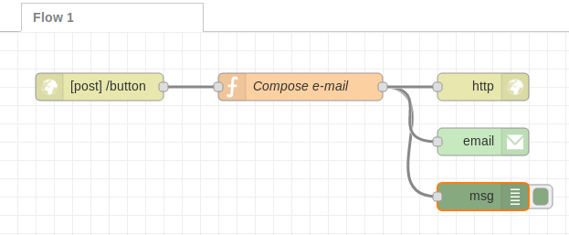
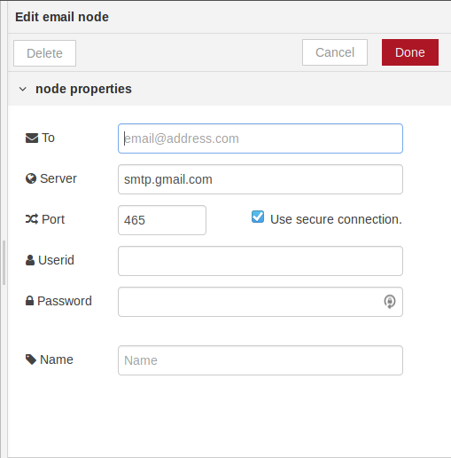
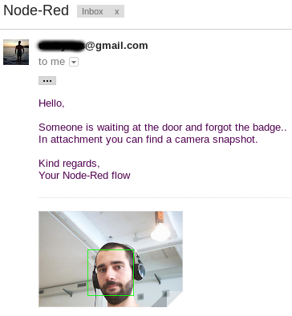
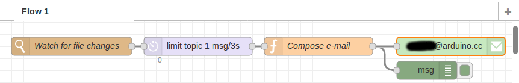
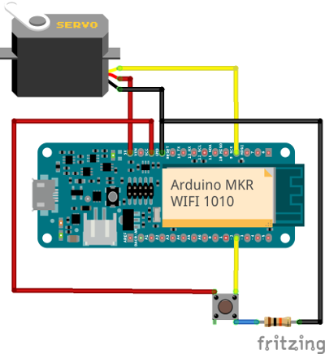
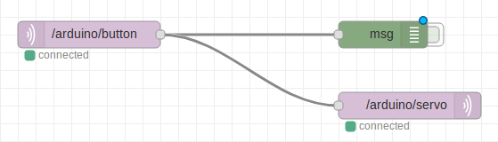

# First Iteration

## Connect your Raspberry Pi

In this tutorial I'll be using [Raspbian Stretch Lite](https://www.raspberrypi.org/downloads/raspbian/ "Download Raspbian"), which is the newest version of Raspbian at the current time, installed on Raspberry Pi 3b+. I chose the Lite version because I don't need the GUI.
It's easier to work on it if you have SSH enabled. To achieve that goal you can follow [this guide](https://www.raspberrypi.org/documentation/remote-access/ssh/), or just create an empty file (without extension) named **SSH** and put it in the *boot* partition of the microSD card.

Now we have to get the ip address of the raspberry pi in order to ssh into it. Basically there are two options:
- you can connect the raspberry pi to your pc using an ethernet cable (here are two guides to do this on [Windows 10](http://www.circuitbasics.com/how-to-connect-to-a-raspberry-pi-directly-with-an-ethernet-cable/) and on [Ubuntu 16.04](https://raspberrypi.stackexchange.com/a/61004)).
- or you can connect via wi-fi, but you have to use display and keyboard. Once you are logged in, just run the command:
  ```bash
  sudo ifconfig
  ```
  Next to the **wlan0** entry you will see **inet addr:xxx.xxx.xxx.xxx** which is the IP address of the Raspberry Pi.


Now that you know the Raspberry's IP, it's possible to control it (in a bash window) using SSH with the command:
```bash
ssh pi@<ip_address_raspi> #Substitute <ip_address_raspi> with the ip address you got before
```
You will now be asked to insert the password, wich by default is `raspberry`.


## GPIO Libraries

First of all we need to check if the GPIO libraries for Python are already installed/updated, so log in to your raspberry pi via ssh and run these commands:
```bash
sudo apt-get update
sudo apt-get install python-rpi.gpio python3-rpi.gpio
```

If you want to test it, you can run the following Python scripts to check the status of a pushbutton connected to pin 8 and to write a message on the terminal ([pushbutton.py](https://github.com/bcmi-labs/arduino-edge-container-demo/blob/master/first_iteration/pushbutton.py) and [pushbutton_event.py](https://github.com/bcmi-labs/arduino-edge-container-demo/blob/master/first_iteration/pushbutton_event.py)).

Let's create a directory to save them in the raspberry pi, so log in to it and just run:
```bash
mkdir ~/python-data
```

Now, transfer the two script files to the raspberry pi:
- if you are on Linux, you can use `scp` like this from you local machine:
  ```bash
  # clone this repo via HTTPS to your local machine 
  git clone https://github.com/bcmi-labs/arduino-edge-container-demo.git # or via SSH if you have set up the key (git@github.com:bcmi-labs/arduino-edge-container-demo.git)

  # copy the script files to your raspberry pi via network (substitute <ip_address_raspi> with the actual ip address)
  scp ./first_iteration/pushbutton.py ./first_iteration/pushbutton_event.py pi@<ip_address_raspi>:~/python-data
  ```
- if you are on Windows, you may want to use an ssh client like [PuTTY](https://www.putty.org/) or [WinScp](https://winscp.net/eng/index.php). For a more complete guide to transfer file, you can have a look at [this tutorial](https://it.cornell.edu/managed-servers/transfer-files-using-putty). 

If scp is not working (Permission denied) you have to change ownership of the destination folder, so log in to the rasberr pi and run
```
chown pi ~/python-data
```

For all the connection I used this scheme:

If you want further information on the GPIO pins you can read something useful [here](https://www.raspberrypi.org/documentation/usage/gpio/, "GPIO documentation")

Finally, you can connect the push button to pin 8 and run the scripts with these commands from the raspberry pi:
```bash
sudo python3 ~/python-data/pushbutton.py
```
or
```bash
sudo python3 ~/python-data/pushbutton_event.py
```

---
# Second Iteration

After installing Raspbian and testing the GPIO pins using Python and a pushbutton, let's add a bit of complexity. Let's add [Docker](https://www.docker.com/get-started)!

1. First of all, we want to bind the Raspberry Pi to our Arduino user by following the Getting Started flow at https://create.arduino.cc/getting-started (if you don't have an Arduino account you can create it one now).

1. Make sure you are logged in and press **NEXT**

1. Go on...

1. Select option A and enter the ip address of the Raspberry Pi

1. You will be prompted with a modal asking for the Raspberry Pi credentials (default are **pi** and **raspberry**)

1. Doing this will install some software on your Raspberry Pi, including the [Arduino Connector](https://github.com/arduino/arduino-connector) and Docker.


If you don't want to use `sudo` when using `docker` you have to create a group *docker* and add your user to the latter:
```bash
$ sudo groupadd docker
$ sudo usermod -aG docker $USER
```

For our project we need [Node-RED](https://nodered.org/) which is a flow-based developement tool for wiring together hardware devices, APIs and online services as part of the Internet of Things.

We can use this [Node-RED Docker container](https://hub.docker.com/r/nieleyde/rpi-nodered-gpio/) which is already configured for
 GPIO use.
To install and run the container you can use the following command:

```bash
$ docker run -d -p 1880:1880 -v ~/node-red-data:/data --privileged --name mynodered nieleyde/rpi-nodered-gpio:latest
```
- `run -d nieleyde/rpi-nodered-gpio:latest` This command will download the container from DockerHub (if it's not already been downloaded) and run it in background
- `-p 1880:1880` This option exposes 1880 port outside the container
- `-v ~/node-red-data:/data` This option mounts the host’s *~/node-red-data* directory as the user configuration directory inside the container. It's useful to backup *flows.json* file. This file contains the configuration of all flows created in Node-RED browser editor.
- `--privileged` This option allows the container to access to all devices, in particular to Raspberry's GPIO pins
- `-- name mynodered` This option gives a human readable name to the container

Now we can check the status of the container with `docker ps`, it should be *up*. 
Furthermore we can stop the container with `docker stop mynodered` and start it again with `docker start mynodered`

It's also possible to modify the flow and nodes through Node-RED's browser-based web interface, connecting to this URL:
`http://<ip_address_raspi>:1880/`

Finally it's also possible to restore the backup of Node-RED's nodes and flows using scp to copy *flows.json* in the folder *node-red-data* created before.
```bash
$ scp ~/Documents/second_iteration/flows.json pi@<ip_address_raspi>:~/node-red-data/

```
The exemple *flows.json* simply reads the value of a GPIO input pin (pin number 8) and prints in the debug tab its value.

### Second Iteration alternative

At the beginning I started using the [official container of Node-RED](https://hub.docker.com/r/nodered/node-red-docker/), instead of the one used in the [Second Iteration](#second-iteration), but I was not able to make it work with GPIO integration.

Finally I succeded. To make it work I used this command:
```bash
docker run -d -p 1880:1880 -v ~/node-red-data:/data --user=root --privileged --name nodered nodered/node-red-docker:0.18.7-rpi-v8

```
It's better to use this container because it's the official one, it's better maintained, and more updated in comparison to the first I used.

I had to run it with `--user=root` because in the [dockerfile](https://github.com/node-red/node-red-docker/blob/master/rpi/Dockerfile) of this container, the developers created the user *node-red* which can not access */dev/mem* (to control the GPIO pins). You can find further information about users [here](https://docs.docker.com/engine/reference/run/#user, "Docker Documentation").

---
# Third Iteration

Our goal in this iteration is to write an Arduino sketch which reads the value of a pushbutton and notifies Node-RED inside the Docker container. The flow in Node-RED has to rework the value recived from the sketch and to send an email to a specified email-address.

For this step there's no need of configuring anything.
You simply have to import and flash the arduino sketch on the Raspberry Pi using the [Arduino Web Editor](https://create.arduino.cc/editor/, "Arduino Web Editor") and to import the flow in Node-RED.

We can upload it using two different ways:
- download locally the sketch *pushbutton_http_post.ino* and import it in the editor (*Arduino Web Editor > Sketchbook > Import*).
- Take the sketch from [here](https://create.arduino.cc/editor/umbobaldi/37776e35-26e8-428b-962f-ba7f4003f3a7/preview) and open it in the web editor.
Now you can upload the code on your Raspberry Pi.

The sketch simply reads the status of the pushbutton (connected to pin 8) and if it's pressed perform an *HTTP POST* using the bash command `curl`. The request is directed to Node-RED's ip and port.

On Node-RED side we have to import the flow located in *third_iteration* folder.
- You can do that as described in the [Second Iteration](#second-iteration), but coping this new flow:
```bash
$ scp ~/Documents/third_iteration/flows.json pi@<ip_address_raspi>:~/node-red-data/

```
- Or you can use a simpler solution: open the *flows.json* file and copy all its content to the clipboard, then use Node-RED import function (*toast menu > import > clipboard*).

Your flow shoud look like this:

<kbd>
  
</kbd>

To make it work you simply have to add the properties inside the e-mail node (Add the recipient, your email address and your password).

<kbd>
  
</kbd>

I had some problems using my gmail account. To use my email I had to disable *less secure apps* [here](https://myaccount.google.com/lesssecureapps).

Now it's time to deploy the flow and to test it!

---
# Fourth Iteration

In this iteration we are going to test and try [OpenCV](https://opencv.org/), which is a computer vision library written in *C/C++* and it supports *Python*.

The goal, in this iteration, is to install OpenCV and simply to take a photograph and save it using this library.
Since it's not an easy task to install it, we can use a *docker container* already built!
I used [this](https://hub.docker.com/r/sgtwilko/rpi-raspbian-opencv/) one, which comes already compiled for Raspberry Pi and Raspbian Stretch.

To install it I used this command:
```bash
$ docker run -it --privileged -v ~/opencv-data:/data --name opencv sgtwilko/rpi-raspbian-opencv:stretch-latest
```
The various options used in this command are already described in [Second Iteration](#second-iteration).
By the way the option `--privileged` let the container access to all the peripherals connected to our Raspberry, even the webcam/Raspberry Pi Cam.
Personally I used a generic logitech one ([this](http://support.logitech.com/en_us/product/quickcam-communicate-stx-product)).

Furthermore we can stop the container with `docker stop opencv` and start it again with `docker start -i opencv`. (`-i` attach container’s STDIN)

Now you should be in the container's bash!
First of all check if OpenCV is installed by running python interpreter:
``` bash
$ python
Python 2.7.13 (default, Nov 24 2017, 17:33:09) 
[GCC 6.3.0 20170516] on linux2
Type "help", "copyright", "credits" or "license" for more information.
>>>
```
And then try to import OpenCV library:
```
>>> import cv2
>>> 
```
If you don’t get any errors, you can move on to the next part.
To exit the interpreter simply use `exit()`.

The script I wrote simply take a photo from the webcam and save it in `/data/opencv.png`.

You can copy the script to your raspberry using *scp*
```bash
scp ~/Documents/fourth_iteration/test.py pi@<ip_address_raspi>:~/opencv-data/
```
To run the script simply start the docker container (`docker start -i opencv`),
move to the correct directory (`cd data/`), and finally run the script with `python test.py`.

You can open and see the photo if you copy it to your pc:
```bash
scp pi@<ip_address_raspi>:~/opencv-data/opencv.png ~/Documents/
```
___

# Fifth Iteration

In this iteration we are going to do some **Face Detection**!
If you do not have OpenCV installed on your Raspberry Pi just follow the instruction in the [Fourth Iteration](#fourth-iteration).

Basically Face Detection will detect if a photo contains a face and the position of the face.

Before OpenCV                     | After OpenCV
:--------------------------------:|:----------------------------------:
 | 

OpenCV uses a cascade file (an xml file) which contains data to detect objects, in our case it's used for faces. You only have to initialize it in your code.
OpenCV comes with different cascades built in, for detecting several things such as eyes, hands, legs, animals and so on.
In this tutorial we are going to use Haar Cascade Classifier,
It's a machine learning based approach where a cascade function is trained from a lot of positive (images with face) and negative images (images without face). The algorithm is proposed by Paul Viola and Michael Jones.
Further information [here](https://en.wikipedia.org/wiki/Haar-like_feature)

Next step is to copy the cascade file (`haarcascade_frontalface_alt.xml`) to the Raspberry
```bash
scp ~/Documents/fifth_iteration/haarcascade_frontalface_alt.xml pi@<ip_address_raspi>:~/opencv-data/
```
Then you can copy some test images to the Raspberry
```bash
scp ~/Documents/fifth_iteration/test.jpg pi@<ip_address_raspi>:~/opencv-data/
```
The script I wrote simply opens a photo passed as argument, tries to find faces, and saves the image with faces in the same folder.
You can copy it to the Raspberry with:
```bash
scp ~/Documents/fifth_iteration/face_detection.py pi@<ip_address_raspi>:~/opencv-data/
```

Now everything is configured and you can run the script!
First you have to start the docker container with `docker start -i opencv`,
then you can move to the correct directory (`cd data/`), and finally run the script (`python face_detection.py test.jpg`).

You can open and see the photo with faces if you copy it to your pc:
```bash
scp pi@<ip_address_raspi>:~/opencv-data/test_ocv.jpg ~/Documents/
```

---

# Sixth Iteration

In this iteration we are going to put together all the previous iterations.


The Idea:
- An **Arduino sketch** will run every 15 seconds a shell command to start a docker container.
- A Docker Container which contains **OpenCV** will run a python script on startup. This script will take a photo using a webcam, will draw in the photo a rectangle around a face (if there is one) and save the image in a docker shared volume with the name *opencv.png* if at least one face is found. After all that the container will stop.
- In another Docker Container, a flow in **Node-RED**, will watch the shared volume, waiting for changes in the file *opencv.png*. If the file is changed (the photo is overwritten), the flow composes an email (attaching the photo) and sends it.

<kbd>
  
</kbd>

### Arduino sketch

Let's start with the arduino code.
For uploading the sketch to the raspberry you can follow [Third Iteration](#third-iteration).
You can either download it from this repo and import it to [Arduino Web Editor](https://create.arduino.cc/editor/,) or use this [link](https://create-intel.arduino.cc/editor/umbobaldi/2de421c6-dcd8-4327-bdf1-6223e638afd5/preview, "Arduino Start Docker OpenCV")

### Docker container OpenCV

The Docker Container OpenCv part is a bit more complex.
Fist of all you have to create a docker volume to share data between the two containers:
``` bash
docker volume create share
```
To check if everything is ok you can check the list of volumes, you shound also see the newly created volume with `docker volume ls`.

As an experiment I created a docker image, to make the procedure simpler, but if you prefer to build the image by yourself you can read [Docker build OpenCV](#docker-build-opencv) part.
If you have Docker already installed on your Raspberry run this command to download [my image](https://hub.docker.com/r/umbobaldi/opencv_face_detection/):

``` bash
    docker run -it --privileged -v share:/data --name face_detection umbobaldi/opencv_face_detection:1.0
```
- With `-it` you can see a short log and check if everything is ok
- `-v share:/data` mounts the docker volume *share* and binds it with */data* folder inside the container.

The image is already configured to run on startup a python script which uses OpenCV.

The script:
- Take a photo from the webcam
- Does some face detection, likewise described in [Fifth Iteration](#fifth-iteration)
- Saves the photo (*opencv.png*) in the data folder, which is connected to the shared volume, if at least one face is found. Otherwise nothing is saved.
When the script finish the execution the docker container is stopped.

### Docker container Node-Red

In the end you can import *flows.json* as described in [Third iteration](#third-iteration).
Open the file and copy all its content to the clipboard, then use Node-RED import function (*toast menu > import > clipboard*).
To make it work you simply have to add the properties inside the e-mail node (add the recipient, your email address and your password).

Here's the result:

<kbd>
  
</kbd>

This flow:
- Waits for changes in the file *opencv.png* located in the shared volume. When there is a change it means the old file is overwritten by a newer file, so it's time to send an e-mail.
- The *delay node* has to filter the input: when the other container overwrites the file the process in not immediate. So the messages have to be limited to one.
- The *function node* composes the e-mail attaching the photo and writing a proper message.
- In the end the e-mail is sent by the *e-mail node*.

#### Docker build OpenCV

I decided to build my own docker image because I wanted to learn how to do it.
You can find all the files I used in `sixth_iteration/docker_image_files`.

To build the image you have to move in the folder where is located the *Dockerfile* with `cd sixth_iteration/docker_image_files` and run the command:
```bash
docker build -t myopencv:<version> .
```
This command will build your image. To check if everything is ok you can list all docker images with `docker images -a`, if your newly created image is listed you can go on and you can run it, the first time with:
``` bash
docker run -it --privileged -v share:/data --name face_detection myopencv:<version>
```
Or, if it's not the first time, with `docker start -i face_detection`.

The image is modeled after [this one](https://hub.docker.com/r/sgtwilko/rpi-raspbian-opencv/) which has already OpenCV installed.
My Dockerfile creates two folders. One for the code and the other one for sharing the photo. Then mooves *camera.py* and *haarcascade_frontalface_alt.xml* inside the newly created folder inside the container (`/usr/scr/ocv_face_detection`). In the end it starts the python script on startup.

# Seventh Iteration
The goal in this iteration is to send and receive [Mqtt](https://en.wikipedia.org/wiki/MQTT) messages from an [Arduino MKR WiFi 1010](https://store.arduino.cc/arduino-mkr-wifi-1010). This Arduino has to publish Mqtt message on a topic when a pushbutton connected to it is pressed. Another Arduino (or the same, in this case) is subscribed to another topic and moves the shaft of a servomotor, which is able to open a door.

The Arduino is connected via WiFi to a Raspberry Pi 3b+ which is configured as an access point. The Raspberry has to run an Mqtt Broker (I used [Mosquitto](https://mosquitto.org/)). I installed and run this broker using docker, because it was easier.
In the end a Node-Red flow is responsible for the logic.

### Arduino sketch

The sketch I wrote simply connects through Wi-Fi to the Raspberry, connects to the Mqtt Broker in the docker container running on the Raspberry, publish a message on */arduino/button* topic when the pushbutton is pressed. And is subscribed to */arduino/servo* topic: when a message is published on this topic the arduino activates a servomotor, which is able to open a door. If the wi-fi connection is working the built-in led is turned on.

To program, and to flash the code I used the [web editor](https://create.arduino.cc/editor).

For uploading the sketch to the Arduino you can simply connect it to your pc, [install the Arduino Create plugin](https://create.arduino.cc/devices/) and follow [Third Iteration](#third-iteration) to install `arduino_button_servo_mqtt.ino`. Or you can use this [link](https://create.arduino.cc/editor/umbobaldi/3eb6a80b-6925-4069-b8a8-3953bb478f8f/preview).

For the wiring part:



### Raspberry Pi configuration

- **Access Point**: You have to configure the Raspberry so that the Arduino can connect to it. The idea is to make the onboard wireless card act like an access point and not as a client. To achieve that you can follow [this guide](https://www.raspberrypi.org/documentation/configuration/wireless/access-point.md), but it's not so easy. Personally I used [this tool](https://github.com/oblique/create_ap) which simplifies a lot the process.
First of all you have to install all its dependencies. Then you can clone the repo and insall the script.
To  set up the access point I used this command:
`sudo create_ap -n --no-virt  wlan0 RaspberryPi3b+_Net RaspberryPi`
    + `-n` Disable Internet sharing
    + `--no-virt` Do not create virtual interface
    + `wlan0` Is the name of the interface
    + `RaspberryPi3b+_Net` Is the SSID of the wireless network
    + `RaspberryPi` Is the passphrase

- **Node-RED flow**: The idea is to make a flow which is able to publish on `/arduino/servo` when receives a message on another topic (`/arduino/button`). The flow must be subscribed to this second topic to achieve that. In the end you can import *flows.json* as described in [Third iteration](#third-iteration). Your flow should look like this:
<kbd>
  
</kbd>

- **Mosquitto docker**: Finally we can install our Mqtt Broker. I choose Mosquitto because it's opensource, easy to set-up and simple. I installed it through a Docker container because it was easier. I used [this image](https://hub.docker.com/r/mjenz/rpi-mosquitto/), it's really lightweight (2Mb) and comes preconfigured. The installation is similar to the one described in [First Iteration](#first-iteration). To run it the fist time:`docker run -d -p 1883:1883 --name mqtt mjenz/rpi-mosquitto` and the other times: `docker start mqtt`.